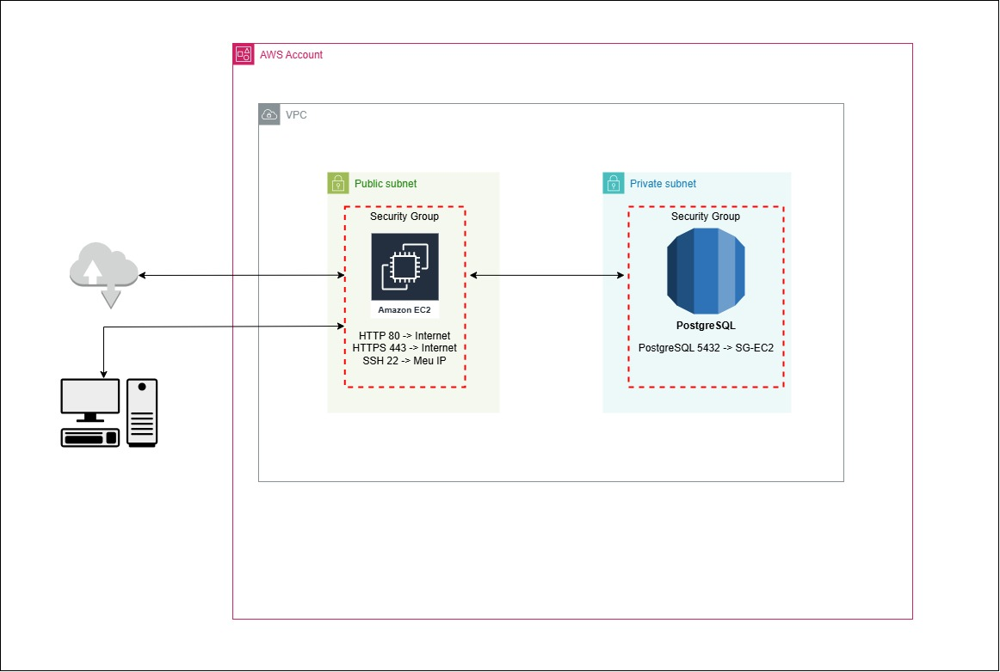
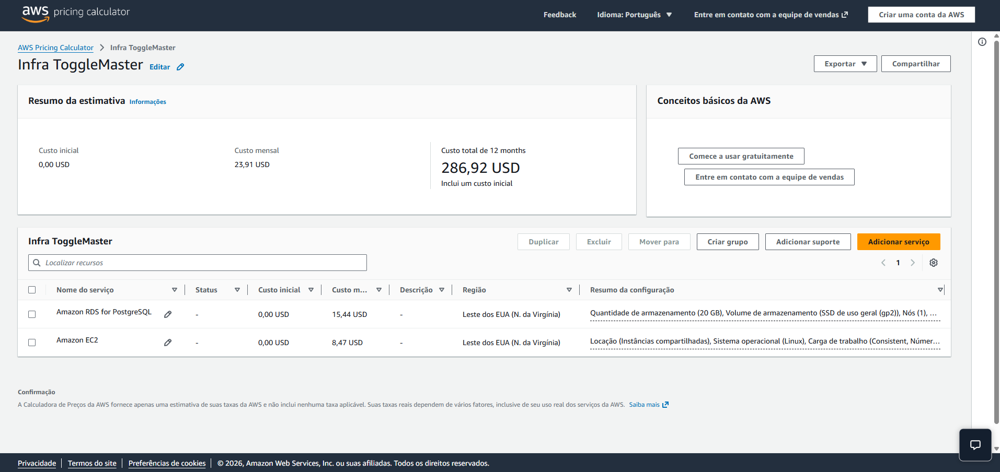

# Tech Challenge - Arquitetura Monolítica na AWS

## Arquitetura da Solução

> A imagem representa a separação entre camada de aplicação e banco de dados dentro de uma VPC, utilizando boas práticas básicas de segurança.

---

## Descrição da Arquitetura

A arquitetura foi construída na AWS utilizando uma abordagem simples, adequada para um cenário de MVP.

### Componentes:

- **VPC**: isolamento da rede
- **Sub-rede pública**:
  - EC2 responsável pela aplicação
- **Sub-rede privada**:
  - RDS PostgreSQL
- **Security Groups**:
  - EC2:
    - HTTP (80) → Internet
    - HTTPS (443) → Internet
    - SSH (22) → IP restrito
  - RDS:
    - PostgreSQL (5432) → apenas EC2

### Fluxo:

A aplicação é exposta via Nginx na porta 80, que atua como proxy reverso encaminhando as requisições para a aplicação Flask executando internamente na porta 5000.

---

## Infraestrutura implementada

### EC2

- Tipo: t2.micro
- Sistema: Amazon Linux 2023
- Responsável por:
  - Rodar a API Flask via Gunicorn
  - Executar Nginx como proxy reverso

---

### RDS

- Engine: PostgreSQL
- Tipo: db.t3.micro
- Armazenamento: 20GB
- Sem acesso público
- Acesso restrito via Security Group

#### Configuração do banco de dados

O banco de dados foi criado manualmente, juntamente com um usuário específico para a aplicação.

Foram aplicadas permissões para permitir que a aplicação pudesse criar e manipular tabelas dentro do schema público, garantindo o funcionamento da inicialização via comando `flask init-db`.

O acesso ao banco é permitido exclusivamente a partir da instância EC2, garantindo que não exista exposição direta à internet.

---

### Nginx

O Nginx foi utilizado como proxy reverso, atuando como ponto de entrada da aplicação.

Sua principal função é desacoplar a porta da aplicação da exposição externa, permitindo que a API seja acessada via porta 80, enquanto a aplicação continua rodando internamente na porta 5000.

Benefícios dessa abordagem:

- Não expor diretamente a porta da aplicação
- Padronizar o acesso via HTTP
- Melhor organização da arquitetura
- Possibilidade futura de adicionar HTTPS sem alterar a aplicação

Fluxo de requisição:

Internet → Nginx (porta 80) → Aplicação Flask (porta 5000) → RDS

---

## Segurança

A arquitetura foi desenhada considerando princípios básicos de segurança.

### Security Group da EC2

- Porta 80 aberta para acesso público
- Porta 443 preparada para uso futuro com HTTPS
- Porta 22 restrita a um IP específico para acesso administrativo

### Security Group do RDS

- Porta 5432 liberada apenas para o Security Group da EC2
- Sem acesso direto da internet

### Outras práticas aplicadas

- Banco de dados em subnet privada
- Comunicação interna via VPC
- Princípio de menor privilégio entre os recursos
- Separação entre camada de aplicação e dados

Essa abordagem garante que apenas a aplicação tenha acesso ao banco de dados, reduzindo a superfície de ataque.

---

## Processo de Deploy

O deploy foi automatizado via script `setup.sh`, que executa:

1. Limpeza do diretório da aplicação
2. Instalação de dependências (Python, pip, dos2unix, nginx)
3. Cópia dos arquivos da aplicação
4. Conversão de arquivos para padrão Unix (LF)
5. Criação de ambiente virtual (venv)
6. Instalação de dependências via `requirements.txt`
7. Carregamento de variáveis de ambiente (`.env`)
8. Inicialização do banco de dados (`flask init-db`)
9. Configuração do Nginx
10. Configuração do serviço systemd
11. Start da aplicação

---

## Testes da API

Foi disponibilizada no repositório uma pasta contendo uma collection do Insomnia.

Essa collection foi utilizada para validar os endpoints da aplicação tanto em ambiente local quanto no ambiente em produção (EC2), facilitando a execução de testes e a validação do comportamento da API.

---

## Análise da aplicação como monólito

A aplicação analisada é considerada um monólito porque toda a lógica do sistema está concentrada em um único projeto. Isso significa que funcionalidades como regras de negócio, acesso ao banco de dados e endpoints da API estão no mesmo código e são executadas em um único processo.

Não existe separação entre serviços independentes, como ocorreria em uma arquitetura de microsserviços.

---

## Vantagens e desvantagens para um MVP

### Vantagens

- Simplicidade de desenvolvimento
- Deploy mais rápido
- Menor custo inicial
- Facilidade de entendimento

### Desvantagens

- Escalabilidade limitada
- Alto acoplamento
- Manutenção mais complexa com crescimento
- Risco maior de impacto em mudanças

---

## Análise baseada nos 12-Factor App

### Pontos atendidos

- Código versionado (Git)
- Dependências declaradas (`requirements.txt`)
- Uso de variáveis de ambiente (parcial)

### Pontos de melhoria

- Configuração ainda parcialmente acoplada
- Logs não estruturados
- Falta separação clara entre build/release/run
- Escalabilidade limitada por ser monolito

---

## Estimativa de custo

Estimativa realizada com AWS Pricing Calculator:

[AWS Pricing Calculator](https://calculator.aws/#/estimate?nc2=h_pr_calc&id=7139aa9abce194c09554daa08f3b3f275031dc8c)

### Recursos considerados:

- EC2 t2.micro
- RDS db.t3.micro
- 20GB armazenamento
- Modelo On-Demand

### Custo estimado:

**~23,91 USD/mês**

Esse valor é adequado para um ambiente de MVP, mantendo baixo custo e simplicidade.

---

## Boas práticas aplicadas

- Banco em subnet privada (não exposto)
- Security Group restritivo (RDS só aceita EC2)
- SSH limitado por IP
- Uso de proxy reverso (Nginx)
- Variáveis de ambiente para configuração
- Automação de deploy via script

---

## Conclusão

A solução atende bem ao objetivo de um MVP:

- Simples
- Funcional
- Baixo custo
- Segura dentro do contexto proposto

Para evolução futura:

- Implementar HTTPS (SSL)
- Melhorar observabilidade (logs estruturados)
- Separar camadas (possível migração para microsserviços)
- Pipeline de CI/CD